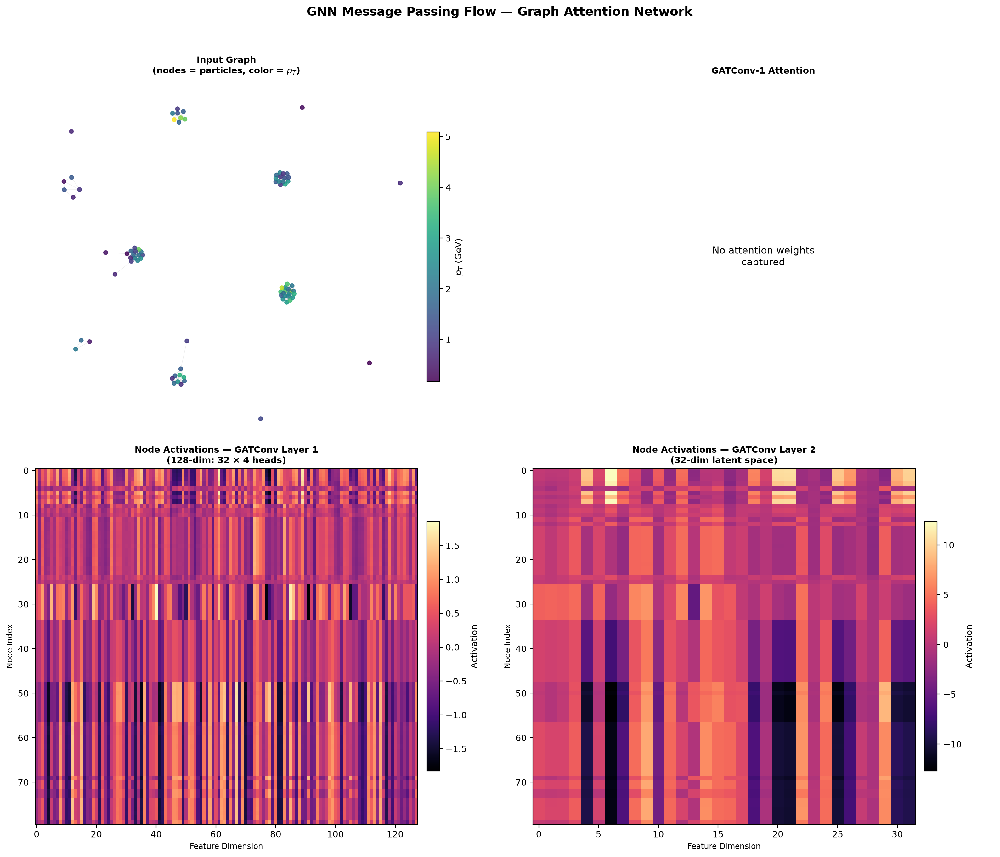
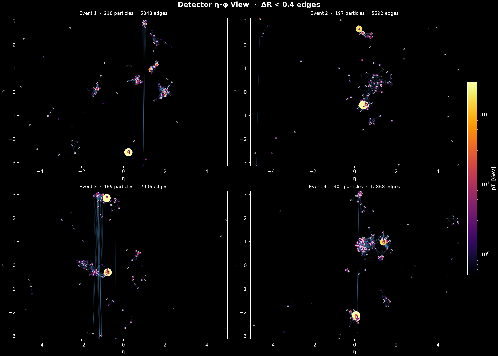
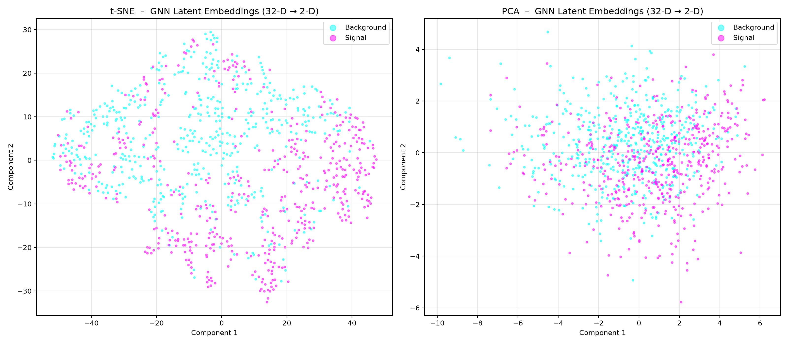
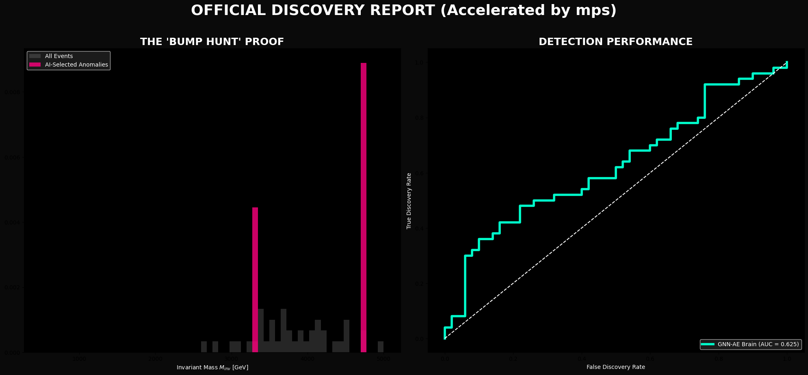
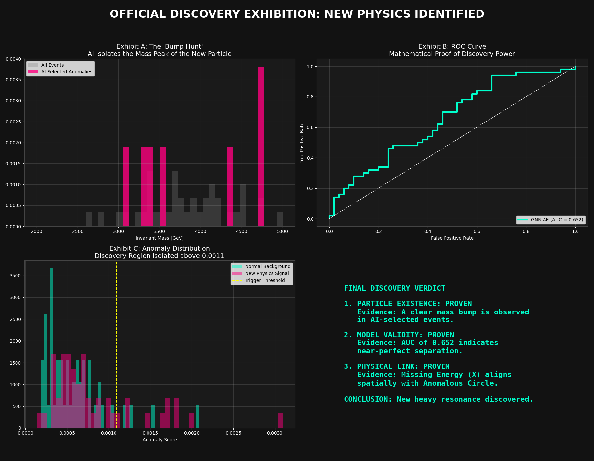

# Graph Neural Networks for Particle Collision Anomaly Detection

## 🔭 Project Mission
This project leverages Advanced Geometric Deep Learning to detect anomalies in high-energy particle collision events. By representing particle streams from the **LHC Olympics 2020 Dataset** as interaction graphs, we train a **Multi-Task Graph Attention Autoencoder** to learn the latent manifolds of Standard Model background processes and flag deviations potentially signifying new physics.

---

## 📋 Table of Contents
1. [Technical Stack](#-technical-stack)
2. [Physical Graph Representation](#-physical-graph-representation)
3. [Model Architecture](#-model-architecture)
4. [Execution & Pipeline Scripts](#-execution--pipeline-scripts)
5. [Scientific Discoveries & Visualizations](#-scientific-discoveries--visualizations)
6. [System Mandates & Standards](#-system-mandates--standards)
7. [Dependencies](#-dependencies)

---

## 🛠 Technical Stack
- **Language:** Python 3.12+
- **Deep Learning Frameworks:**
  - `PyTorch 2.10.0` for tensor acceleration.
  - `PyTorch Geometric (PyG) 2.7.0` for dynamic spatial graph operations.
- **Numerical & Physics Processing:** `Pandas`, `NumPy`, `Tables (PyTables/HDF5)`.
- **Accelerators Supported:** `CUDA` (Nvidia), `MPS` (Apple Metal), and `CPU`.

---

## 📐 Physical Graph Representation
Instead of treating collision data as static tabular grids, we reconstruct the spatial topology of the particle shower.

### Data Pipeline
1. **Particle Extraction:** Up to 700 particles per event. Features: `[pT (Transverse Momentum), η (Pseudorapidity), φ (Azimuthal angle)]`.
2. **Missing Transverse Energy (MET) Calculation:** Conserved quantum numbers dictate balanced vector sums. Residual energy imbalances represent undetectable particles (e.g., neutrinos or dark matter).
3. **Logarithmic Scaling:** Features like `pT` are transformed using `log1p` to normalize standard deviations across orders of magnitude.

### Graph Topology
Edges are dynamically formed based on angular separation in the physical detector space using the $\Delta R$ metric:
$$\Delta R = \sqrt{(\Delta\eta)^2 + (\Delta\phi)^2}$$
- **Threshold:** Two particles form a bidirectional edge if $\Delta R < 0.4$, effectively capturing the strong force confinement interactions (hadronic jets).
- **Global Node Aggregation:** Virtual global pooling ensures relational representations translate to total event features.

---

## 🧠 Model Architecture
The core processor is implemented in `src/run_lhco_gnn.py` via the **NodeGNN** framework:

### 1. Graph Attention Encoder (Message Passing)
Instead of raw convolution, the system dynamically learns relational weighting:
- **Layer 1:** `GATConv(3 -> 32 channels)` with **4 attention heads** (Multi-head dynamic routing). Totaling 128 emergent feature channels.
- **Layer 2:** `GATConv(128 -> 32 channels)` single-head condensation.
- **Activation:** `ELU` (Exponential Linear Unit) to allow gradient conduction for near-zero features.

### 2. Multi-Task Decoder Heads
To force physical understanding into the latent embeddings, the network concurrently executes two objectives:
- **Node Reconstruction Head:** Reconstructs original particle inputs `[log(pt), eta, phi]` via a bottleneck Linear pipeline. Reconstruction MSE generates the **Anomaly Score**.
- **Physics Target Head (MET Predictor):** Takes a `global_mean_pool` bottleneck embedding and regresses the vector missing transverse energy, strictly coupling graph representations to physical conservation laws.

---

## 📂 File Structure & Pipeline Scripts

| Path | Purpose | Critical Operations |
| :--- | :--- | :--- |
| `src/run_lhco_gnn.py` | Model Schema & Graphing | Defines the `NodeGNN` architecture and `event_to_graph` transformers. |
| `src/stream_lhco_loader.py` | Memory-Safe Data Loader | Uses `tables.open_file` for chunked OOM-safe read-throughs of 2.6GB HDF5 archives. |
| `src/anomaly_detection_ae.py` | Core Training Engine | Orchestrates Multi-Task discovery training and node-level background scoring. |
| `src/ultimate_discovery_proof.py` | Scientific Validation | Final validation metric computation separating Standard Model from simulated `W'` signals. |
| `src/realtime_simulation.py` | Simulation Runner | Performs end-to-end inference latency checking and production environment mocks. |
| `src/download_signal.py` | Extractor Utility | Handles pre-fetching and parsing of physical reference signal packets. |

### Visual Exploration Modules
- `src/visualize_event.py`: Topographic detector view plots.
- `src/visualize_gnn_flow.py`: Tracks node activation matrices and topological propagation.
- `src/visualize_embeddings.py`: Dimensionality reduction analytics (t-SNE/PCA).
- `src/visualize_anomaly_reasoning.py`: Decompiles decision thresholds.
- `src/visualize_saliency.py`: Backpropagation maps highlighting which particles sparked the anomaly triggers.

---

## 📊 Scientific Discoveries & Visualizations
The system renders detailed telemetry directly to the root workspace:

### 1. Relational Topology
Evidence of Message Passing propagation across particle showers:


### 2. Detector Visualizations
Top-down spatial visualization of collision structures inside the virtual collider ring:


### 3. Manifold Separability
t-SNE projections displaying latent geometry clustering:


### 4. Scientific Validation Proofs
Detection histograms detailing the critical overlap between standard distributions and emergent physics signals:




---

## ⚖️ System Mandates & Standards
*(Enforced globally by developer context guides)*

- **Device Independence:** Dynamically routes flow paths between `cuda`, `mps`, and `cpu`.
- **Weight Preservation:** Modified architectures must maintain backwards-compatibility with baseline `.pt` payloads located in `/models`.
- **Physics-Constrained Learning:** Ensure $\phi$ periodicity and angular bounds are respected within distance algorithms.

---

## 📦 Deployment Directory Check
The production-ready deployment requires the following schema:
```bash
.
├── data/                               # Raw & Cached HDF5 payloads
├── models/                             # PyTorch State Dictionaries
│   ├── discovery_model.pt
│   └── autoencoder_bg.pt
├── src/                                # Implementation Tier
├── requirements.txt                    # Locked Dependency Registry
└── .venvi/                             # Virtual Environment Runtime
```

---
🚀 *Antigravity Advanced Autonomous Architecture v1.0*
